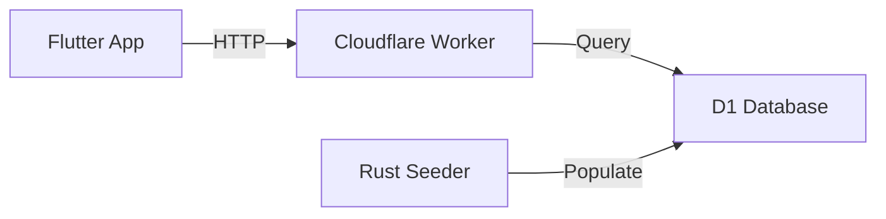
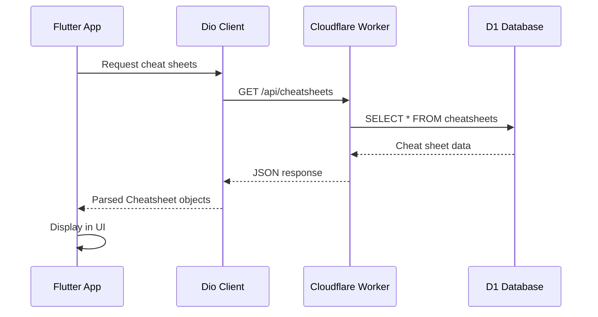

## Overview

The Cheat Sheets app uses a Cloudflare Workers backend to serve cheat sheet data via a REST API. This guide covers setting up the backend locally for development.

<Info>
  The backend repository is separate from the main app: [ivansaul/devstack-worker](https://github.com/ivansaul/devstack-worker)
</Info>

## Architecture

The backend consists of:

- **Cloudflare Workers** - Serverless API endpoints
- **Cloudflare D1** - SQLite-based database
- **Rust** - Database seeding and data processing
- **Wrangler** - Cloudflare development CLI



## Prerequisites

<Steps>
  <Step title="Install Rust">
    Install the Rust toolchain:
    ```bash
    curl --proto '=https' --tlsv1.2 -sSf https://sh.rustup.rs | sh
    ```
  </Step>
  
  <Step title="Install Node.js & npm">
    Required for running Wrangler CLI.
    [Installation Guide](https://docs.npmjs.com/getting-started/installing-node)
  </Step>
  
  <Step title="Install Wrangler">
    Cloudflare Workers CLI tool:
    ```bash
    npm install -g wrangler
    ```
  </Step>
</Steps>

## Setup Instructions

### Step 1: Clone the Worker Repository

Clone the backend repository:

```bash
git clone https://github.com/ivansaul/devstack-worker.git
cd devstack-worker
```

<Note>
  This is a **separate repository** from the main app. You'll need both repositories for full local development.
</Note>

### Step 2: Create the Database

Run the Rust seeder to generate the database schema and seed data:

```bash
cargo run -p cheatsheets
```

This command:
- Compiles the Rust seeder package
- Generates the `schema.sql` file
- Processes cheat sheet data for insertion

<Accordion title="What does the seeder do?">
  The Rust seeder:
  - Reads cheat sheet markdown files
  - Processes and structures the data
  - Generates SQL schema for Cloudflare D1
  - Creates INSERT statements for initial data
</Accordion>

### Step 3: Initialize D1 Database

Create and populate the local D1 database:

```bash
npx wrangler d1 execute CHEATSHEETS --local --file=./schema.sql
```

<Tabs>
  <Tab title="Command Breakdown">
    - `wrangler d1 execute` - Execute SQL on D1 database
    - `CHEATSHEETS` - Database name (defined in `wrangler.toml`)
    - `--local` - Use local development database
    - `--file=./schema.sql` - SQL file to execute
  </Tab>
  
  <Tab title="Expected Output">
    ```bash
    🌀 Executing on local database CHEATSHEETS from ./schema.sql
    🚣 Executed X commands in Yms
    ```
  </Tab>
</Tabs>

### Step 4: Start the Development Server

Run the Wrangler development server:

```bash
npx wrangler dev --ip 0.0.0.0 --port 8787
```

<Info>
  Using `--ip 0.0.0.0` allows access from other devices on your network, including Android emulators.
</Info>

The server will start at:
- **Localhost**: `http://localhost:8787`
- **Network**: `http://YOUR_IP:8787`

## API Endpoints

The backend exposes the following REST API endpoints:

### List All Cheat Sheets

```http
GET /api/cheatsheets
```

Returns metadata for all available cheat sheets.

**Response Example:**
```json
[
  {
    "id": "python",
    "title": "Python",
    "tags": ["programming", "language"],
    "categories": ["Programming Languages"],
    "background": "#3776ab",
    "icon": "python.svg",
    "intro": "Python is a high-level programming language..."
  }
]
```

### Get Cheat Sheet Details

```http
GET /api/cheatsheets/:id
```

Returns full content for a specific cheat sheet including all sections.

**Parameters:**
- `id` - Cheat sheet identifier (e.g., "python", "rust", "git")

**Response Example:**
```json
{
  "id": "python",
  "title": "Python",
  "tags": ["programming", "language"],
  "categories": ["Programming Languages"],
  "background": "#3776ab",
  "icon": "python.svg",
  "intro": "Python is a high-level programming language...",
  "sections": [
    {
      "title": "Variables",
      "content": "# Variables\n\n```python\nx = 5\n```"
    }
  ]
}
```

## Environment Configuration

Connect your Flutter app to the local backend:

### Configure .env_debug

Update the `.env_debug` file in your Flutter app root:

<Tabs>
  <Tab title="iOS Simulator">
    ```bash .env_debug
    API_CHEATSHEET_BASE_URL=http://localhost:8787/api
    API_CHEATSHEET_LIST_ENDPOINT=/cheatsheets
    API_CHEATSHEET_DETAIL_ENDPOINT=/cheatsheets/:id
    ```
  </Tab>
  
  <Tab title="Android Emulator">
    ```bash .env_debug
    # Use your machine's IP address
    API_CHEATSHEET_BASE_URL=http://192.168.1.100:8787/api
    
    # Or use Android emulator's special alias
    # API_CHEATSHEET_BASE_URL=http://10.0.2.2:8787/api
    
    API_CHEATSHEET_LIST_ENDPOINT=/cheatsheets
    API_CHEATSHEET_DETAIL_ENDPOINT=/cheatsheets/:id
    ```
  </Tab>
  
  <Tab title="Physical Device">
    ```bash .env_debug
    # Must use your machine's network IP
    API_CHEATSHEET_BASE_URL=http://192.168.1.100:8787/api
    API_CHEATSHEET_LIST_ENDPOINT=/cheatsheets
    API_CHEATSHEET_DETAIL_ENDPOINT=/cheatsheets/:id
    ```
    
    <Warning>
      Ensure your development machine and device are on the same network.
    </Warning>
  </Tab>
</Tabs>

### Finding Your IP Address

<Tabs>
  <Tab title="macOS/Linux">
    ```bash
    ifconfig | grep "inet "
    ```
    
    Look for the IP address next to your active network interface (usually `en0` or `wlan0`).
  </Tab>
  
  <Tab title="Windows">
    ```bash
    ipconfig
    ```
    
    Look for "IPv4 Address" under your active network adapter.
  </Tab>
</Tabs>

### Regenerate Environment Code

After updating `.env_debug`, regenerate the environment configuration:

```bash
dart run build_runner build --delete-conflicting-outputs
```

This updates `lib/src/shared/env.g.dart` with your new configuration.

## Testing the Backend

Verify the backend is running correctly:

### Using curl

```bash
# Test list endpoint
curl http://localhost:8787/api/cheatsheets

# Test detail endpoint
curl http://localhost:8787/api/cheatsheets/python
```

### Using Browser

Open in your browser:
- `http://localhost:8787/api/cheatsheets`
- `http://localhost:8787/api/cheatsheets/python`

### From Flutter App

Run the app and verify:
1. Cheat sheets load on the main screen
2. Tapping a cheat sheet shows its content
3. Search functionality works

<Note>
  Check the Flutter app's network logs or Wrangler terminal output for API request details.
</Note>

## Network Service Implementation

The Flutter app uses Dio for HTTP requests. Key files:

<Tabs>
  <Tab title="Network Service">
    **Location**: `lib/src/shared/services/network/dio_network_service.dart`
    
    Implements the HTTP client using Dio with:
    - Request/response interceptors
    - Error handling
    - Base URL configuration
  </Tab>
  
  <Tab title="Environment Config">
    **Location**: `lib/src/shared/env.dart:36`
    
    Manages API endpoints:
    ```dart
    @EnviedField(varName: 'API_CHEATSHEET_BASE_URL')
    static final String apiCheatsheetBaseUrl
    
    @EnviedField(varName: 'API_CHEATSHEET_LIST_ENDPOINT')
    static final String apiCheatsheetListEndpoint
    
    @EnviedField(varName: 'API_CHEATSHEET_DETAIL_ENDPOINT')
    static final String apiCheatsheetDetailEndpoint
    ```
  </Tab>
  
  <Tab title="Data Sources">
    **Cheat Sheets Data Source**: `lib/src/features/cheatsheets/data/remote_cheatsheet_data_source.dart`
    
    Fetches cheat sheet data from the API.
    
    **Asset Data Source**: `lib/src/features/cheatsheets/data/asset_cheatsheet_data_source.dart`
    
    Fallback for loading from local assets.
  </Tab>
</Tabs>

## Deployment Configuration

For production deployment to Cloudflare Workers:

<Steps>
  <Step title="Configure wrangler.toml">
    Update the `wrangler.toml` file with your account details and D1 database binding.
  </Step>
  
  <Step title="Create Production Database">
    ```bash
    wrangler d1 create CHEATSHEETS
    ```
  </Step>
  
  <Step title="Execute Schema">
    ```bash
    wrangler d1 execute CHEATSHEETS --file=./schema.sql
    ```
    
    (Note: No `--local` flag for production)
  </Step>
  
  <Step title="Deploy Worker">
    ```bash
    wrangler deploy
    ```
  </Step>
</Steps>

<Note>
  The production backend is automatically deployed via GitHub Actions when changes are pushed to the repository.
</Note>

## Troubleshooting

<AccordionGroup>
  <Accordion title="Wrangler dev fails to start">
    **Possible causes:**
    - Port 8787 is already in use
    - Wrangler not installed or outdated
    
    **Solutions:**
    ```bash
    # Use a different port
    npx wrangler dev --ip 0.0.0.0 --port 8788
    
    # Update Wrangler
    npm install -g wrangler@latest
    ```
  </Accordion>
  
  <Accordion title="Database not found error">
    Ensure you've created and populated the D1 database:
    ```bash
    npx wrangler d1 execute CHEATSHEETS --local --file=./schema.sql
    ```
    
    Check `wrangler.toml` for correct database binding name.
  </Accordion>
  
  <Accordion title="Flutter app can't connect">
    **Checklist:**
    1. Backend server is running (`npx wrangler dev`)
    2. Correct IP address in `.env_debug`
    3. Firewall allows connections on port 8787
    4. Device/emulator is on the same network
    5. Regenerated env code (`dart run build_runner build`)
  </Accordion>
  
  <Accordion title="Cargo command not found">
    Install Rust:
    ```bash
    curl --proto '=https' --tlsv1.2 -sSf https://sh.rustup.rs | sh
    source $HOME/.cargo/env
    ```
  </Accordion>
  
  <Accordion title="CORS errors in browser testing">
    Cloudflare Workers may need CORS headers configured. Check the worker's response headers include:
    ```
    Access-Control-Allow-Origin: *
    Access-Control-Allow-Methods: GET, POST, OPTIONS
    ```
  </Accordion>
</AccordionGroup>

## Development Workflow

Typical workflow for full-stack development:

<Steps>
  <Step title="Start Backend Server">
    ```bash
    cd devstack-worker
    npx wrangler dev --ip 0.0.0.0 --port 8787
    ```
    
    Keep this terminal running.
  </Step>
  
  <Step title="Update Environment Config">
    Ensure Flutter app's `.env_debug` points to local backend.
  </Step>
  
  <Step title="Run Flutter App">
    ```bash
    cd cheat-sheets
    flutter run
    ```
  </Step>
  
  <Step title="Make Changes">
    - Modify worker code → Changes reload automatically
    - Modify database → Re-run `wrangler d1 execute`
    - Modify Flutter code → Hot reload with `r`
  </Step>
</Steps>

## API Data Flow



## Adding New Cheat Sheets

To add new cheat sheet content:

<Steps>
  <Step title="Add Content">
    Add your cheat sheet markdown file to the worker repository's data directory.
  </Step>
  
  <Step title="Run Seeder">
    ```bash
    cargo run -p cheatsheets
    ```
    
    This regenerates `schema.sql` with the new content.
  </Step>
  
  <Step title="Update Database">
    ```bash
    npx wrangler d1 execute CHEATSHEETS --local --file=./schema.sql
    ```
  </Step>
  
  <Step title="Restart Worker">
    The development server will automatically reload with the new data.
  </Step>
</Steps>

## Next Steps

<CardGroup cols={2}>
  <Card title="Using the App" icon="mobile" href="/guides/using-the-app">
    Learn about app features and user interface
  </Card>
  
  <Card title="Development Setup" icon="code" href="/guides/development-setup">
    Configure your Flutter development environment
  </Card>
</CardGroup>

## Additional Resources

<CardGroup cols={2}>
  <Card title="Cloudflare Workers" icon="cloud" href="https://developers.cloudflare.com/workers/">
    Official Cloudflare Workers documentation
  </Card>
  
  <Card title="Cloudflare D1" icon="database" href="https://developers.cloudflare.com/d1/">
    SQLite-based database documentation
  </Card>
  
  <Card title="Wrangler CLI" icon="terminal" href="https://developers.cloudflare.com/workers/wrangler/">
    Wrangler command-line tool guide
  </Card>
  
  <Card title="Worker Repository" icon="github" href="https://github.com/ivansaul/devstack-worker">
    Backend source code on GitHub
  </Card>
</CardGroup>